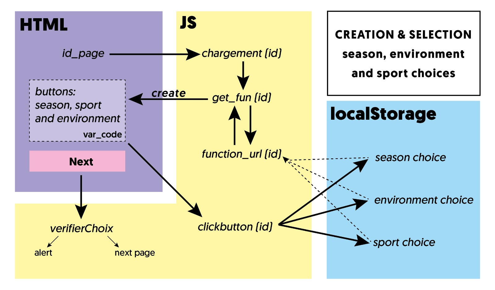

# ITI, multisports routing application

ITI is the result of a final year project of 4 students of the [GéoNum master's degree](https://mastergeonum.org/) (Lyon / Saint-Étienne, France): [Idrissa Djepa Creutz](https://github.com/IdrissaD), [Maodo Kante](https://twitter.com/KanteyeMaodo), [Ashley Ouedraogo](http://linkedin.com/in/ashley-ouédraogo-9a3809185) and [Lubin Picard](https://twitter.com/Lubin_Picard).

It is an application that allows the user to calculate a route through a sport activity chosen by him.

It works with a PostgreSQL database, connected to a GeoServer that interfaces with the JavaScript scripts.

## Database

To install the application, the `BD.sql` database must be downloaded and imported into a PostgreSQL database (for example via the "restore" option of PgAdmin).
The extensions installed with the database are PostGIS and pgRouting.

The road graph used in ITI was created from the IGN's [BD TOPO](https://geoservices.ign.fr/documentation/diffusion/telechargement-donnees-libres.html) and is limited to the Alpes-Maritimes department, but in principle you can use any road graph you have (obtained with osmtopgrouting for example).

## GeoServer

Launch GeoServer and connect a warehouse to the database containing the graph and the sports data.

Then create the following SQL views, EPSG is 4326 for all:


### chemin

This is the "route" view, with two parameters `source` and `target`:

```
SELECT
	MIN(a.seq) AS seq,  
        ST_Collect(b.geom),
        sum(b.distance) AS distance
FROM
	pgr_dijkstra ('SELECT gid as id, source, target, distance AS cost FROM edges', %source%, %target%, FALSE)
	a INNER JOIN edges b ON (a.edge = b.gid) ORDER BY seq
```

Regular expression for validation is: `^[\w\d\s]+$`


### noeud

This is the "nodes" view, with two parameters `x` and `y`:
```
SELECT
  v.id,
  v.the_geom
FROM
  edges_vertices_pgr AS v,
  edges AS e
WHERE
  v.id = (SELECT
            id
          FROM edges_vertices_pgr
          ORDER BY the_geom <-> ST_SetSRID(ST_MakePoint(%x%, %y%), 4326) LIMIT 1)
  AND (e.source = v.id OR e.target = v.id)
GROUP BY v.id, v.the_geom
```
Regular expression for validation is: `^[.\w\d\s]+$`

Default values can be:

x: `7.14518`

y: `43.99156`


### tout

This view returns all the `sport_06` table:
```
SELECT * FROM sport_06
```


### saison

This view returns all the seasons from the features that are within the bufferized envelope around the departure and arrival chosen by the user, it has two parameters `dep` and `arr`:
```
SELECT DISTINCT saison, saison_code from sport_06
WHERE ST_Intersects(geom,
ST_Buffer(ST_Envelope(ST_GeomFromText('LINESTRING(%dep%, %arr%)', 4326)),0.01))
```
Regular expression for validation is:
`^[.\w\d\s]+$`

Default values can be:

dep: `7.14518 43.99156`

arr: `7.342542 43.808902`


### milieu

This view returns all the practice environments of features that comply with the 'saison' view and the saison chosen by the user, it has three parameters `dep`, `arr` and `saison_code`:
```
SELECT DISTINCT milieu, milieu_code
FROM sport_06
WHERE ST_Intersects(geom,
ST_Buffer(ST_Envelope(ST_GeomFromText('LINESTRING(%dep%, %arr%)', 4326)),0.01))
AND saison_code = '%saison_code%'
```
Regular expression for validation is:

dep and arr: `^[.\w\d\s]+$`

saison_code: `^[\w\d\s]+$`


### sport

This view returns all the sports of features that comply with `saison` and `milieu` views and the environment chosen by the user, it has all the previous parameters and milieu_code:
```
SELECT DISTINCT sport, sport_code
FROM sport_06
WHERE ST_Intersects(geom,
ST_Buffer(ST_Envelope(ST_GeomFromText('LINESTRING(%dep%, %arr%)', 4326)),0.01))
AND saison_code = '%saison_code%'
AND milieu_code = '%milieu_code%'
```
Regular expression for validation is:

dep and arr: `^[.\w\d\s]+$`

saison_code and milieu_code: `^[\w\d\s]+$`


### etape

This view returns all the features that comply with 'saison', 'milieu' and 'sport' views, it has all the previous parameters and sport_code:
```
SELECT * FROM sport_06
WHERE ST_Intersects(geom,
ST_Buffer(ST_Envelope(ST_GeomFromText('LINESTRING(%dep%, %arr%)', 4326)),0.01))
AND saison_code = '%saison_code%'
AND milieu_code = '%milieu_code%'
AND sport_code = '%sport_code%'
```
Regular expression for validation is:

dep and arr: `^[.\w\d\s]+$`

saison_code, milieu_code and sport_code: `^[\w\d\s]+$`


## JavaScript

All the JS files are well commented, but here is a schema explaining the functioning of button pages files and functions:



## Map's features
* Draggable departure and arrival markers, new routing with the new locations
* Info control displaying info on the routes, updated with each new routing
* Button allowing the export of actual route to gpx using [togpx plugin](https://github.com/tyrasd/togpx)
* Filter of equipments by sport with a layers control
* A (very french) joke is hidden in the map (and in the scripts), try to find it!

## Limits of ITI

* Note that the road graph used does not include costs for road sections. Consequently, the routes can take any road (except motorways), including unmade roads not suitable for cycling.
* The data used to gather the sports equipments ([BPE from INSEE](https://www.insee.fr/fr/metadonnees/source/serie/s1161)) does not include individual names, so the only thing that distinguishes two ski stations are their geom/coordinates.
* [CORS](https://developer.mozilla.org/en-US/docs/Web/HTTP/CORS) restrictions must be lifted in order for the application to work properly, either by enabling it in GeoServer settings, or by running the app in a local web server (Sublime Text or Visual Studio Code extensions, Python HTTPServer, etc.)
